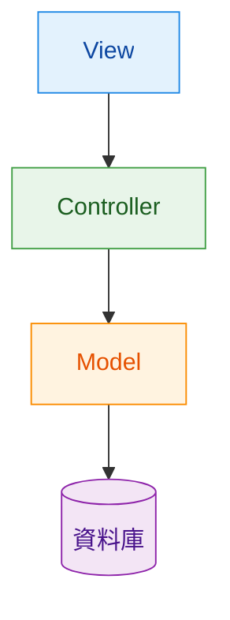
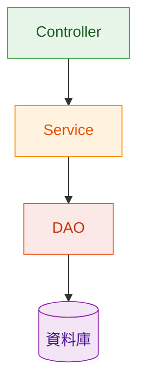
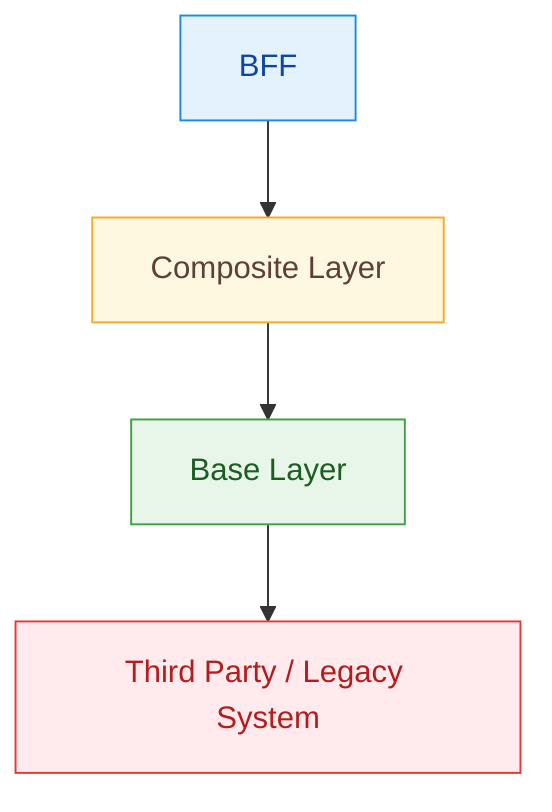
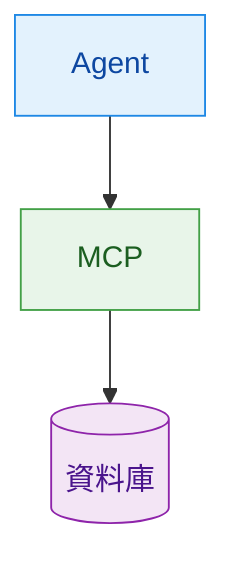

# Takeaway: Agent 權限管理與 MCP 分隔分享

## 這次分享想講什麼

**主題**：當 agent 透過 MCP 連接外部能力時，如何把權限管理與能力邊界切清楚。  
**一句話版本**：MCP 的價值不只是標準化工具接入，而是讓 agent 的能力邊界可以被清楚定義、分隔與治理。

## 為什麼要談權限管理

agent 的風險通常不是來自模型本身，而是來自「外部能力過大、邊界不清」。

- 權限管理不是附屬議題，而是架構設計核心。
- 沒有邊界，就沒有可控性。
- 不是工具越多越好，而是工具暴露要剛好。
- 不是模型越強越好，而是模型能力要被限制在對的邊界內。

## MCP 在這裡扮演什麼角色

MCP 是 **protocol / tool layer**，不是 agent framework。  
它的關鍵價值是把外部能力整理成可控工具，讓 capability 更容易被拆分、觀察與治理。

可以用三層來理解：

1. **授權層（Authorization）**
   - OAuth / consent / scope
   - 核心問題：誰可以用、可用到什麼程度
2. **工具層（Tool Surface）**
   - tool definitions
   - read-only vs destructive（讀取型 vs 破壞型操作）
   - 核心問題：agent 可呼叫哪些動作
3. **邊界層（Runtime Boundary）**
   - server、roots、sandbox、approval flow
   - 核心問題：就算 agent 想做，也能不能做、要不要經過人

## 怎麼分隔能力（實務案例）

- **資料庫**：把查詢工具與寫入工具拆開，不要用同一把萬用 DB tool。
- **檔案系統**：只給明確 `roots`，不要把整台機器直接暴露給 agent。
- **內部 API**：敏感 API 放在更嚴格的 MCP server 後面，搭配更嚴格 scope 與 approval。

## 常見分層類比（非演進）

以下是概念上的類比，目的是幫助理解「邊界與責任分隔」，不是在描述技術世代演進。
我不是說 MCP 等於 MVC/3-tier，而是它們共享同一個核心：把責任與權限邊界切清楚。

### MVC

最經典的 UI 分層：`View` 負責畫面、`Controller` 接請求、`Model` 管資料與規則，最後由 model 存取資料庫。  
重點是把「畫面互動」和「資料邏輯」分開，降低耦合。

### 3-Tier

在 MVC 概念上再細分：`Controller` 處理入口、`Service` 放商業邏輯、`DAO` 專責資料存取。  
重點是把「業務規則」與「資料存取細節」拆開，方便測試與維護。

### Microservices Layered Architecture (BFF / Composite / Base)

常見於大型系統整合：`BFF` 面向前端需求，`Composite` 組裝多個能力，`Base` 封裝底層系統。  
重點是逐層隔離複雜度，避免前端直接面對第三方或舊系統差異。

### Agent + MCP

`Agent` 不直接連資料庫，而是透過 `MCP` 這層工具協定去呼叫能力。  
重點是把「能力暴露與權限邊界」集中在 MCP 管理，讓治理與審計更清楚。

## 架構面的影響（結論）

導入 MCP Toolbox 後，架構設計重心會從「agent 能不能接到工具」轉向「能力怎麼被治理」。

- 能力邊界變成可設計、可稽核的架構元素。
- 風險控制從事後補救，前移到工具設計與授權模型。
- agent 從「黑箱自動化」走向「可控、可觀測、可治理」的系統。
